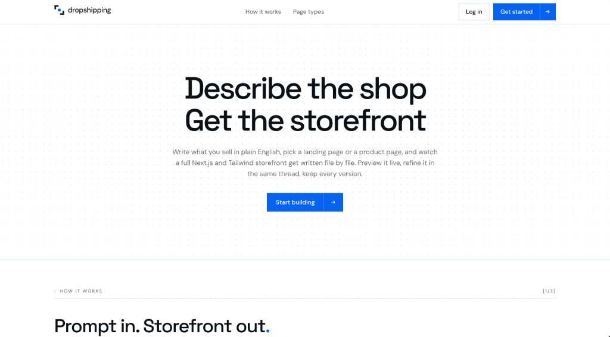

# DropShipping

DropShipping is an AI-powered storefront builder that turns a natural-language description into a production-ready e-commerce website. Users can generate connected landing and product pages, preview the result live, refine it through chat, upload product images, restore previous versions, and export the complete website as a deployable Next.js project.

HydraDB provides contextual memory across pages and sessions, allowing Claude to preserve a shop's visual identity and reuse relevant work from earlier projects.



## Tech Stack

- **Frontend:** Next.js 15, React 19, TypeScript, Tailwind CSS v4
- **AI:** Anthropic Claude API with streaming generation and model selection
- **Memory:** HydraDB graph API
- **Authentication and data:** Supabase Auth, PostgreSQL with Row Level Security, and Supabase Storage
- **Live preview:** CodeSandbox Sandpack
- **Export:** JSZip
- **Deployment:** Vercel for the application, Railway and Docker for HydraDB

## How HydraDB Is Used

- Acts as the contextual memory layer for AI generation.
- Stores relationships between users, projects, sessions, prompts, themes, components, and generated pages.
- Helps Claude preserve colors, fonts, layouts, and other design choices across landing and product pages.
- Retrieves relevant prompts and project context before Claude generates or refines a page.
- Enables cross-session recall so users can reuse and adapt websites they created previously.
- Keeps the generated experience consistent, personalized, and aware of earlier work.

## Running Locally

### Prerequisites

- Node.js 20.9 or later
- npm
- Docker Desktop
- A Supabase project
- An Anthropic API key

### Setup

1. Clone the repository and install dependencies:

   ```bash
   git clone <repository-url>
   cd dropshipping
   npm install
   ```

2. Create the local environment file:

   ```bash
   cp .env.example .env.local
   openssl rand -hex 32
   ```

3. Add your Supabase URL, Supabase publishable key, Anthropic API key, and generated encryption key to `.env.local`:

   ```env
   NEXT_PUBLIC_SUPABASE_URL=
   NEXT_PUBLIC_SUPABASE_PUBLISHABLE_KEY=
   ANTHROPIC_API_KEY=
   APP_ENCRYPTION_KEY=
   ```

4. In the Supabase SQL Editor, run the three migrations in `supabase/migrations` in numerical order.

5. Start HydraDB:

   ```bash
   npm run hydra:up
   ```

   The default HydraDB settings in `.env.example` work with the local Docker service.

6. Start the application:

   ```bash
   npm run dev
   ```

7. Open [http://localhost:3000](http://localhost:3000), create an account, and start generating a storefront.

To stop HydraDB, run:

```bash
npm run hydra:down
```
